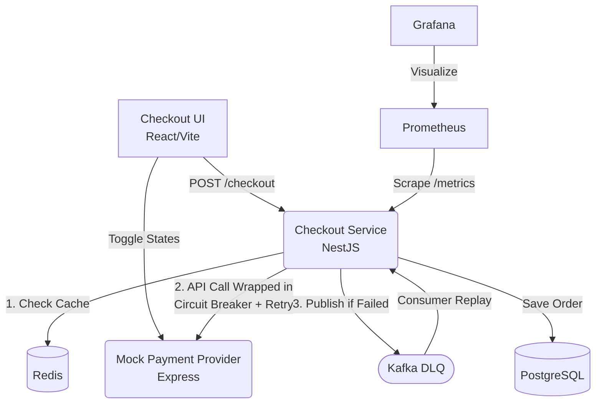

# Resilient Payment Gateway Simulator

This is a microservices-based project demonstrating 5 core backend resilience patterns to survive third-party API failures.

## 🏗️ Architecture

## 🛠️ Tech Stack

- **Frontend**: React (Vite)
- **Backend**: NestJS (TypeScript), Express.js (Node.js)
- **Databases & Caching**: PostgreSQL, Redis
- **Message Broker**: Apache Kafka, Zookeeper
- **Monitoring & Observability**: Prometheus, Grafana
- **Infrastructure & Libraries**: Docker, Docker Compose, Opossum (Circuit Breaker)

  
## 💥 How to Trigger the Failure Demo

1. **Happy Path**: Open the Checkout UI, enter an amount, and click "Pay Now". You will see a "Payment Confirmed" success message.
2. **Trip the Circuit**: 
   - Open the Grafana Dashboard to visualize live stats.
   - On the UI's Admin Panel, click **Fail (500)** to simulate a payment gateway outage.
   - Submit checkouts repeatedly. The first 3 requests will be retried (with exponential backoff) before failing.
   - After 5 failures, the **Circuit Breaker trips open**.
3. **Graceful Degradation**: 
   - With the circuit open, subsequent checkouts will fast-fail without waiting for timeouts.
   - The Checkout Service will check Redis for cached pricing and return a **Degraded** response. The UI will show a warning note.
4. **Dead Letter Queue (DLQ)**:
   - If Redis cache expires or is missing, checkouts fall through and are published to Kafka DLQ. The UI will show a **Queued** status.
5. **Recovery**:
   - Click **Recover (200)** in the Admin Panel.
   - The DLQ Consumer will detect the recovery, process the queued messages in the background, and update the order statuses to confirmed in PostgreSQL.
   - The circuit breaker transitions back to `closed` state automatically.

---
